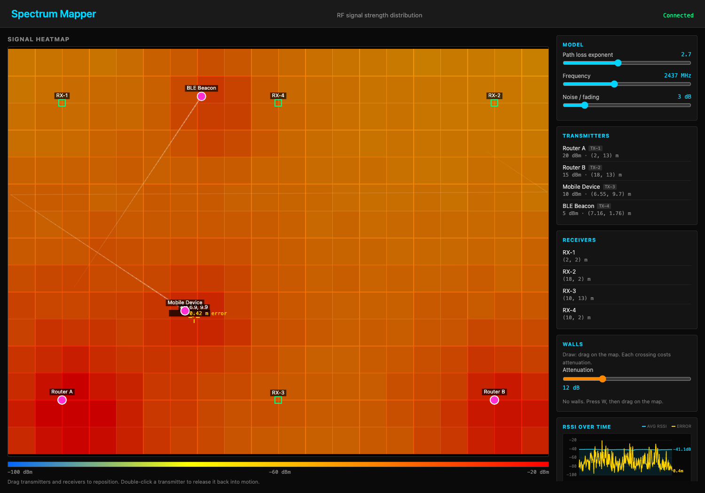

<!--
No demo GIF yet: none has been recorded, and a placeholder image would imply a
recording exists. See docs/README-hero.md for how to record one.
-->
<h1 align="center">Spectrum Mapper</h1>

<p align="center">
  Interactive 2.4 GHz RF coverage simulator, with position estimation from RSSI.
</p>

<p align="center">
  <a href="#quick-start">Quick start</a> ·
  <a href="#what-it-does">Features</a> ·
  <a href="#architecture">Architecture</a> ·
  <a href="#performance">Measured performance</a> ·
  <a href="#roadmap">Roadmap</a>
</p>

<p align="center">
  
</p>

<p align="center">
  <a href="https://github.com/0xsan7/spectrum-mapper/actions/workflows/ci.yml">
    
  </a>
  <a href="LICENSE">
    
  </a>
  <a href="https://nodejs.org/en/download">
    
  </a>
  <a href="package.json">
    
  </a>
</p>

---

## What it does

A browser map of a 20 × 15 m room showing where 2.4 GHz signal actually lands,
driven by a real log-distance path loss model rather than a decorative
gradient. Move the transmitters, draw walls, turn the propagation knobs, and
watch four receivers try to work out where the mobile device is.

- **Coverage heatmap** over a 1 m grid, with a dBm legend and a hover readout
- **Drag and drop** for transmitters and receivers; double-click a transmitter
  to release it back into motion
- **Live model controls** — path loss exponent, carrier frequency, fading
- **Wall obstacles** with per-wall dB attenuation, casting real shadows on the
  grid
- **Trilateration** of the mobile transmitter, with the estimate drawn against
  the true position and the error in metres
- **RSSI and error time series**, plus movement trails
- **Export** the map as PNG, or the data as CSV/JSON over HTTP

## Quick start

Requires Node 22 or newer (tested on 22 and 24).

```sh
git clone https://github.com/0xsan7/spectrum-mapper.git
cd spectrum-mapper
npm install
npm start
```

Open <http://localhost:3000>.

```sh
npm run dev     # restart on file changes
npm test        # runs the suite once, no watch mode
npm run lint    # eslint
npm run format  # prettier --write
```

Or in Docker:

```sh
docker build -t spectrum-mapper .
docker run --rm -p 3000:3000 spectrum-mapper
```

### Controls

| Action                         | How                             |
| ------------------------------ | ------------------------------- |
| Move a transmitter or receiver | Drag it                         |
| Release a pinned transmitter   | Double-click it                 |
| Draw a wall                    | Press `W`, then drag on the map |
| Remove all walls               | `Clear walls` in the sidebar    |
| Pause / resume                 | `Space` or the Pause button     |
| Reset everything               | `R`                             |
| Cycle map mode                 | `M`                             |

### Configuration

Every value has a default, so the app runs with no `.env` at all. Copy
`.env.example` to `.env` to change any of them:

| Variable                     | Default        | Meaning                                |
| ---------------------------- | -------------- | -------------------------------------- |
| `PORT`                       | `3000`         | HTTP port                              |
| `HOST`                       | `0.0.0.0`      | Bind address                           |
| `ROOM_WIDTH` / `ROOM_HEIGHT` | `20` / `15`    | Room size in metres                    |
| `GRID_RESOLUTION`            | `1`            | Metres per heatmap cell                |
| `UPDATE_RATE`                | `500`          | Milliseconds between frames            |
| `HISTORY_CAPACITY`           | `240`          | Samples kept in the time-series buffer |
| `MIN_RSSI` / `MAX_RSSI`      | `-100` / `-20` | Display range in dBm                   |

Real process environment variables take precedence over `.env`.

## The model

Signal is modelled with a log-distance path-loss law, reference loss normalised
by distance, wall attenuation, and fading — see [docs/model.md](docs/model.md).

## Architecture

<p align="center">
  
</p>

The server owns the simulation; the browser sends intent and renders what comes
back, so two browsers open at once cannot disagree. Module responsibilities and
the HTTP API are in
[docs/architecture.md](docs/architecture.md), which also carries a Mermaid
version of this diagram.

## Project structure

<p align="center">
  
</p>

Every tracked file, one line and a comment each —
[docs/tree.md](docs/tree.md). Regenerate with `npm run tree`.

## Performance

Measured per-operation cost and localisation accuracy on the author's machine —
see [docs/performance.md](docs/performance.md).

## Testing

The suite runs on `node:test` with no framework dependency — see
[docs/testing.md](docs/testing.md).

## Known limitations

- **The heatmap is a simulation, not a measurement.** It models one log-distance
  path; real rooms have reflections, shadowing, and material variation. Treat it
  as an educational model, not a site survey tool.
- **"Error in metres" is only meaningful against a simulated truth.** The server
  knows where the transmitter actually is because it is the one moving it. A real
  deployment has no such ground truth and would need a different metric.
- **Two receivers cannot disambiguate a mirrored position.** The tool shows both
  candidates rather than pretending to know which is right.
- **The grid is recomputed from scratch every frame.** Fine at 300 cells
  (0.5 ms), but it is O(cells × sources) and is the first thing that would need a
  spatial index at a much finer resolution.
- **No persistence.** Reloading loses walls, positions, and history.
- **No authentication.** It binds `0.0.0.0` by default and every client can move
  everything. Fine for a local tool; do not expose it to a network you do not
  control.

## Roadmap

Roughly in the order I expect to do them.

- [ ] **Persistence** — save and load room layouts, walls, and positions
- [ ] **Add and remove receivers**, since the estimator's behaviour is so
      sensitive to their geometry
- [ ] **Spatially coherent fading** — the current fading is per measurement, so it
      does not produce the smooth structure a real multipath field has
- [ ] **Obstacle library** — prebuilt wall types with realistic dB values
      (brick, concrete, drywall, glass) instead of a bare attenuation number
- [ ] **Fingerprinting mode** — walk a known path, record the RSSI curve, and
      compare a later walk against it
- [ ] **Faster grid** — spatial partitioning so resolution can go well past 1 m
      without the frame budget moving
- [ ] **Recorded demo GIF** — an actual capture of the app, none exists yet
- [ ] **A real accuracy metric** for when there is no simulated truth

## Changelog

Release notes and the full list of fixes live in
[CHANGELOG.md](CHANGELOG.md).

## Contributing

See [CONTRIBUTING.md](CONTRIBUTING.md). Changes to the physics model need a test
that fails before the change and passes after — the note there explains why.

## License

MIT — see [LICENSE](LICENSE).
