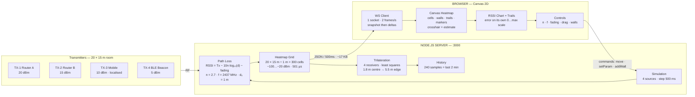

<!--
No demo GIF yet: none has been recorded, and a placeholder image would imply a
recording exists. See docs/README-hero.md for how to record one.
-->
<h1 align="center">Spectrum Mapper</h1>

<p align="center">
  Interactive 2.4 GHz RF coverage simulator, with position estimation from RSSI.
</p>

<p align="center">
  <a href="#quick-start">Quick start</a> ·
  <a href="#what-it-does">Features</a> ·
  <a href="#architecture">Architecture</a> ·
  <a href="#performance">Measured performance</a> ·
  <a href="#roadmap">Roadmap</a>
</p>

<p align="center">
  <a href="https://github.com/0xsan7/spectrum-mapper/actions/workflows/ci.yml">
    
  </a>
  <a href="LICENSE">
    
  </a>
  
  
</p>

---

## What it does

A browser map of a 20 × 15 m room showing where 2.4 GHz signal actually lands,
driven by a real log-distance path loss model rather than a decorative
gradient. Move the transmitters, draw walls, turn the propagation knobs, and
watch four receivers try to work out where the mobile device is.

- **Coverage heatmap** over a 1 m grid, with a dBm legend and a hover readout
- **Drag and drop** for transmitters and receivers; double-click a transmitter
  to release it back into motion
- **Live model controls** — path loss exponent, carrier frequency, fading
- **Wall obstacles** with per-wall dB attenuation, casting real shadows on the
  grid
- **Trilateration** of the mobile transmitter, with the estimate drawn against
  the true position and the error in metres
- **RSSI and error time series**, plus movement trails
- **Export** the map as PNG, or the data as CSV/JSON over HTTP

## Quick start

Requires Node 22 or newer (tested on 22 and 24).

```sh
git clone https://github.com/0xsan7/spectrum-mapper.git
cd spectrum-mapper
npm install
npm start
```

Open <http://localhost:3000>.

```sh
npm run dev     # restart on file changes
npm test        # runs the suite once, no watch mode
npm run lint    # eslint
npm run format  # prettier --write
```

Or in Docker:

```sh
docker build -t spectrum-mapper .
docker run --rm -p 3000:3000 spectrum-mapper
```

### Controls

| Action                         | How                             |
| ------------------------------ | ------------------------------- |
| Move a transmitter or receiver | Drag it                         |
| Release a pinned transmitter   | Double-click it                 |
| Draw a wall                    | Press `W`, then drag on the map |
| Remove all walls               | `Clear walls` in the sidebar    |
| Pause / resume                 | `Space` or the Pause button     |
| Reset everything               | `R`                             |
| Cycle map mode                 | `M`                             |

### Configuration

Every value has a default, so the app runs with no `.env` at all. Copy
`.env.example` to `.env` to change any of them:

| Variable                     | Default        | Meaning                                |
| ---------------------------- | -------------- | -------------------------------------- |
| `PORT`                       | `3000`         | HTTP port                              |
| `HOST`                       | `0.0.0.0`      | Bind address                           |
| `ROOM_WIDTH` / `ROOM_HEIGHT` | `20` / `15`    | Room size in metres                    |
| `GRID_RESOLUTION`            | `1`            | Metres per heatmap cell                |
| `UPDATE_RATE`                | `500`          | Milliseconds between frames            |
| `HISTORY_CAPACITY`           | `240`          | Samples kept in the time-series buffer |
| `MIN_RSSI` / `MAX_RSSI`      | `-100` / `-20` | Display range in dBm                   |

Real process environment variables take precedence over `.env`.

## The model

Path loss is a standard log-distance model:

```
PL(d) = PL(d0) + 10 · n · log10(d / d0)
```

with `PL(d0) = 20 · log10(4π · d0 · f / c)` — the free-space loss at the
reference distance `d0 = 1 m`. The exponent `n`, the frequency `f`, and the
fading magnitude are all adjustable at runtime. Distance is clamped to a
minimum so `log10` is never evaluated at or below zero, and `n = 2` free space
reproduces the textbook `31.5 dB` at 900 MHz and `40.0 dB` at 2.4 GHz.

Sources combine in **linear power**, not by averaging dBm. Averaging dBm is
arithmetically meaningless, and it made the previous version report a cell
_above_ its own transmitter's power.

Walls are line segments with a thickness. A path only picks up a wall's
attenuation when it genuinely crosses it, and crossed walls sum.

### Position estimation

Each receiver's RSSI is inverted back to a range, then those ranges are fitted
for position. Rather than intersecting circles, the reference receiver's
equation is subtracted from the others to cancel the quadratic terms, leaving
a 2 × 2 linear system solved in closed form. Circle intersection is avoided
because with fading and walls the circles generally do not meet at a single
point, so "pick the best pair" would be arbitrary.

It degrades honestly rather than guessing:

| Receivers            | Behaviour                                                                                                                                                                                                                |
| -------------------- | ------------------------------------------------------------------------------------------------------------------------------------------------------------------------------------------------------------------------ |
| 3 or more            | Least-squares fit, unique                                                                                                                                                                                                |
| Exactly 2            | The normal equations are rank-1, so the geometry is solved directly instead. Two circles meet in up to two mirrored points; both are returned, the fit is flagged ambiguous, and the UI draws the other candidate hollow |
| 1, or all coincident | No solution, reported as such                                                                                                                                                                                            |
| Collinear            | Flagged degenerate instead of dividing by ~0                                                                                                                                                                             |

Readings at or below the noise floor become `NaN` and are dropped from the fit
rather than treated as zero range. Estimates are clamped to the room, since the
target is known to be inside and an estimate outside it is definitely wrong.

The error in metres is computed **server-side**, because it needs the true
position, which only the server has. The browser is shown the result and never
the truth it was compared against.

## Architecture

<p align="center">
  
</p>

<details>
<summary><b>Text version (Mermaid)</b> — same diagram, for renderers that do not display SVG</summary>



</details>

| Module                 | Responsibility                                          |
| ---------------------- | ------------------------------------------------------- |
| `src/server.js`        | HTTP + WebSocket, state ownership, command validation   |
| `src/pathLoss.js`      | Log-distance model, dBm ↔ linear power, grid evaluation |
| `src/heatmap.js`       | Grid generation and statistics                          |
| `src/simulation.js`    | Transmitter positions, velocity, pinning                |
| `src/obstacles.js`     | Wall geometry and per-crossing attenuation              |
| `src/receivers.js`     | Receiver node state                                     |
| `src/trilateration.js` | RSSI → range → position                                 |
| `src/history.js`       | Rolling time-series buffer                              |
| `src/csv.js`           | CSV formatting                                          |
| `public/*`             | Canvas renderer, controls, chart, export                |

The server owns the simulation. The browser sends intent — "move this", "set
this parameter" — and renders the frames that come back. It never computes
physics locally, so two browsers open at once cannot disagree.

### API

```
GET  /api/summary                 rolling aggregates over the buffer
GET  /api/export/timeseries.csv   one row per sample
GET  /api/export/heatmap.csv      one row per grid cell
GET  /api/export/readings.csv     per-receiver readings behind the estimate
GET  /api/export/frame.json       the whole frame
```

## Project structure

<p align="center">
  
</p>

Generated from `git ls-files` by `npm run tree` — the lockfile is excluded, and
a file that no longer exists cannot linger here.

<!-- tree:start -->

```text
├── .dockerignore  # image build context exclusions
├── .env.example  # every setting, documented
├── 🔄 .github/
│   └── workflows/
│       └── ci.yml  # lint, format, test, audit, docs check
├── .gitignore  # ignored paths
├── .prettierignore  # formatting exclusions
├── .prettierrc.json  # formatting config
├── CONTRIBUTING.md  # how to contribute
├── Dockerfile  # multi-stage production image
├── LICENSE  # MIT
├── README.md  # this file
├── 📚 docs/
│   ├── README-hero.md  # how to record the real hero GIF
│   ├── architecture.svg  # architecture diagram
│   └── structure-banner.svg  # file-system banner
├── eslint.config.mjs  # flat config; browser globals declared here
├── package.json  # scripts, engines, dependencies
├── 🖥️ public/
│   ├── chart.js  # RSSI and error time series
│   ├── colors.js  # RSSI → RGB ramp
│   ├── controls.js  # sliders, transport, wall controls
│   ├── dashboard.js  # single app instance, frame dispatch
│   ├── export.js  # PNG compositor
│   ├── favicon.svg  # icon
│   ├── heatmap.js  # canvas renderer, walls, trails, markers
│   ├── index.html  # document shell and sidebar
│   ├── interaction.js  # TX/RX dragging, wall drawing
│   ├── legend.js  # legend built from the same ramp
│   ├── logger.js  # namespaced console logging
│   ├── performance.js  # throttle helper
│   ├── responsive.js  # viewport listener
│   ├── shortcuts.js  # keyboard commands
│   ├── spectrum-analysis.js  # coverage statistics
│   ├── style.css  # all styling
│   └── websocket.js  # connection and reconnect state
├── 🔧 scripts/
│   ├── benchmark.js  # produces the README performance numbers
│   ├── gen-tree.js  # regenerates this tree
│   ├── localisation-errors.js
│   ├── svg-xml.js
│   ├── verify-diagrams.js  # validates the SVG assets
│   └── verify-readme.js  # fails when docs drift from code
├── ⚡ src/
│   ├── ⚙️ config/
│   │   ├── constants.js  # room, grid, model and node defaults
│   │   └── env.js  # dependency-free .env loader
│   ├── csv.js  # CSV formatting for the export API
│   ├── heatmap.js  # grid generation and statistics
│   ├── history.js  # rolling time-series buffer
│   ├── obstacles.js  # wall geometry and per-crossing attenuation
│   ├── pathLoss.js  # log-distance model, dBm ↔ linear power
│   ├── receivers.js  # receiver node state
│   ├── server.js  # Express + ws, state owner, command validation
│   ├── simulation.js  # transmitter positions, velocity, pinning
│   └── trilateration.js  # RSSI → range → position
└── 🧪 test/
    ├── browser.test.js  # browser logic loaded into a VM
    ├── diagrams.test.js
    ├── fixtures/
    │   └── malformed.svg
    ├── heatmap.test.js  # grid and statistics
    ├── history.test.js  # buffer, deltas, CSV quoting
    ├── obstacles.test.js  # wall geometry, server state, NaN handling
    ├── pathLoss.test.js  # model anchored to reference values
    ├── server.test.js  # commands, routes, payload size
    ├── trilateration.test.js  # inversion and degenerate cases
    └── verify-readme.test.js

```

<!-- tree:end -->

Four folders carry the weight:

| Folder     | What lives there                                                                                                                  |
| ---------- | --------------------------------------------------------------------------------------------------------------------------------- |
| `src/`     | The server and the physics. No DOM access, no browser globals — this half runs in Node and is where the tests point.              |
| `public/`  | Classic scripts sharing one global scope, plus the CSS. Not transpiled and not bundled, so `index.html` lists them in load order. |
| `test/`    | `node:test` suites, one per module, plus `browser.test.js` which loads the real `public/*.js` into a VM.                          |
| `scripts/` | The tools that keep the docs honest: the benchmark, the README checker, this tree generator.                                      |

## Performance

**The timings below were measured on the author's machine — Node v26.7.0,
darwin/arm64, default configuration — and are not machine-independent.** A
faster or slower host moves every figure, so CI does not compare them; it only
checks that this section still describes what the code actually does. Re-run
`node scripts/benchmark.js` for numbers from your own hardware.

```
Room 20x15 m at 1 m = 300 cells, 4 sources, 4 receivers

Per-operation cost
  calculateRSSI (per call)              0.24us mean     0.22us median     0.33us p95
  pathLoss (per call)                   0.12us mean     0.11us median     0.18us p95
  generateHeatmap (per frame)         501.46us mean   474.50us median   636.71us p95
  calculateStats (per frame)           15.85us mean    13.67us median    22.38us p95
  leastSquares (per call)               0.47us mean     0.45us median     0.82us p95

Frame budget
  full frame (heatmap + stats + trilateration): 0.518ms
  configured update interval:                500ms
  headroom:                                   966x
  at 1.67us/cell, 500ms allows ~299,125 cells
```

Heatmap generation is essentially the whole frame's cost, and it scales
linearly at about 1.7 µs per cell. The grid size is the limit, not the model.

**Position error**, shipped receiver layout, 3 dB fading, 5000 positions
sampled across the room: mean 4.71 m, median 4.91 m, p95 7.26 m, max 8.07 m.

That average is dominated by positions far from the receivers, so the
breakdown matters more than the headline:

| Distance from room centre | Samples | Mean error |
| ------------------------- | ------- | ---------- |
| 0–2 m                     | 152     | 1.80 m     |
| 2–4 m                     | 448     | 2.47 m     |
| 4–6 m                     | 1033    | 3.64 m     |
| 6+ m                      | 3367    | 5.46 m     |

This is the expected shape: a fixed dB of fading is a _proportional_ range
error, so a target 20 m from a receiver localises worse than one 8 m away. Near
the middle of the default room the estimate is good to about 2 m.

The error is entirely fading, not solver error. With fading disabled the fit is
an exact algebraic inverse and the error is `0.0e+0 m` — which is exactly why
fading is left **on** in the estimator. An earlier version set it to zero and
reported a beautifully precise 0.00 m that measured nothing.

Startup: `require('../src/server')` ≈ 77 ms. Two runtime dependencies, `express`
and `ws`. The 300-cell heatmap serialises to about 8.3 KB; a live frame is
~17 KB, sent at 2 Hz.

## Testing

The suite runs on `node:test` with no test framework dependency.

```sh
npm test
```

They are written to fail when the behaviour is wrong, not merely to pass:

- **The physics is anchored to the model, not to constants copied out of it.** A
  known distance must round-trip through RSSI and back.
- **The trilateration inverse is checked against exact geometry.** Reverting the
  algebra to its earlier sign error made 15 of 28 tests fail.
- **Degenerate cases are explicit** — 1 receiver, coincident receivers,
  collinear receivers, readings below the noise floor.
- **The bandwidth invariant is measured.** A test fills the history buffer and
  asserts a live frame is at least 3× smaller than the same frame carrying
  everything. The bug that motivated it — an index-based delta cursor that
  silently froze the chart after two minutes — was caught by a test asserting
  one sample per frame at capacity, not by reading the code.
- **CSV header and row order are checked against each other**, after a real bug
  paired every heatmap cell with the wrong transmitter's coordinates.

Browser-side logic (the colour ramp, legend, chart scaling) is unit tested by
loading the real files into a VM context, so the tests exercise the shipped code
rather than a copy of it.

## Known limitations

- **The heatmap is a simulation, not a measurement.** It models one log-distance
  path; real rooms have reflections, shadowing, and material variation. Treat it
  as an educational model, not a site survey tool.
- **"Error in metres" is only meaningful against a simulated truth.** The server
  knows where the transmitter actually is because it is the one moving it. A real
  deployment has no such ground truth and would need a different metric.
- **Two receivers cannot disambiguate a mirrored position.** The tool shows both
  candidates rather than pretending to know which is right.
- **The grid is recomputed from scratch every frame.** Fine at 300 cells
  (0.5 ms), but it is O(cells × sources) and is the first thing that would need a
  spatial index at a much finer resolution.
- **No persistence.** Reloading loses walls, positions, and history.
- **No authentication.** It binds `0.0.0.0` by default and every client can move
  everything. Fine for a local tool; do not expose it to a network you do not
  control.

## Roadmap

Roughly in the order I expect to do them.

- [ ] **Persistence** — save and load room layouts, walls, and positions
- [ ] **Add and remove receivers**, since the estimator's behaviour is so
      sensitive to their geometry
- [ ] **Spatially coherent fading** — the current fading is per measurement, so it
      does not produce the smooth structure a real multipath field has
- [ ] **Obstacle library** — prebuilt wall types with realistic dB values
      (brick, concrete, drywall, glass) instead of a bare attenuation number
- [ ] **Fingerprinting mode** — walk a known path, record the RSSI curve, and
      compare a later walk against it
- [ ] **Faster grid** — spatial partitioning so resolution can go well past 1 m
      without the frame budget moving
- [ ] **Recorded demo GIF** — replacing the placeholder at the top
- [ ] **A real accuracy metric** for when there is no simulated truth

## Contributing

See [CONTRIBUTING.md](CONTRIBUTING.md). Changes to the physics model need a test
that fails before the change and passes after — the note there explains why.

## License

MIT — see [LICENSE](LICENSE).
