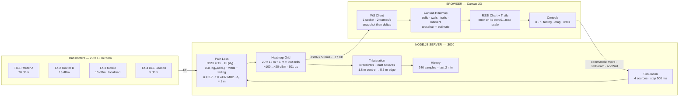

# Architecture

> Part of the [Spectrum Mapper](../README.md) documentation.

The diagram, module responsibilities and HTTP API in full. Moved out of the
README to keep the front page short.

## Text version (Mermaid)

Same diagram, for renderers and readers that do not display SVG.



| Module                 | Responsibility                                          |
| ---------------------- | ------------------------------------------------------- |
| `src/server.js`        | HTTP + WebSocket, state ownership, command validation   |
| `src/pathLoss.js`      | Log-distance model, dBm ↔ linear power, grid evaluation |
| `src/heatmap.js`       | Grid generation and statistics                          |
| `src/simulation.js`    | Transmitter positions, velocity, pinning                |
| `src/obstacles.js`     | Wall geometry and per-crossing attenuation              |
| `src/receivers.js`     | Receiver node state                                     |
| `src/trilateration.js` | RSSI → range → position                                 |
| `src/history.js`       | Rolling time-series buffer                              |
| `src/csv.js`           | CSV formatting                                          |
| `public/*`             | Canvas renderer, controls, chart, export                |

The server owns the simulation. The browser sends intent — "move this", "set
this parameter" — and renders the frames that come back. It never computes
physics locally, so two browsers open at once cannot disagree.

### API

```
GET  /api/summary                 rolling aggregates over the buffer
GET  /api/export/timeseries.csv   one row per sample
GET  /api/export/heatmap.csv      one row per grid cell
GET  /api/export/readings.csv     per-receiver readings behind the estimate
GET  /api/export/measured.csv     the readings that were ingested, not the model
GET  /api/export/frame.json       the whole frame
POST /api/readings                ingest one reading or an array
POST /api/import/readings.csv     the same, from a survey file
```
